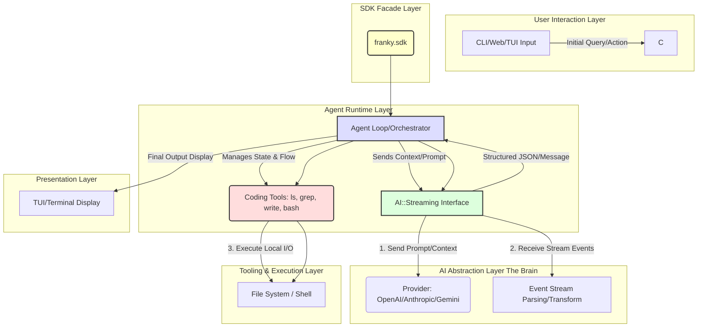

# 🧠 Franky Agent System Architecture Document

## 1. System Overview

Franky is an advanced AI agent framework designed in Zig. Its core purpose is to provide a unified, programmatic interface for building complex, multi-step interactive applications that leverage Large Language Models (LLMs) as a "reasoning engine" while executing actions against a local file system and terminal.

The architecture separates concerns into distinct, loosely coupled layers, making components swappable (e.g., swapping out OpenAI for Gemini) without rewriting core logic.

### Key Architectural Principles:

1.  **Separation of Concerns:** Each major area (AI, Agent, Tools, UI) is contained in its own module.
2.  **Provider Abstraction:** The `ai` layer ensures that the core system logic never talks directly to an LLM API; it only talks to the `ai.stream` interface.
3.  **Facade Pattern:** The `sdk` module acts as the stable public façade, shielding external users from the internal complexity of the `ai` vs. `agent` vs. `coding` layers.

## 2. Architectural Diagram (UML/Mermaid)

This diagram illustrates the flow of data and the dependencies between the major components.

## 3. Component Deep Dive

### A. 💡 AI Abstraction Layer (`src/ai`)
*   **Role:** The most abstracted and critical component. It is responsible for all communication with external LLMs.
*   **Key Mechanisms:**
    *   **`Streaming`:** Uses the `StreamEvent` and `Stream` concepts to process responses as they arrive, essential for good user experience.
    *   **`Provider Registry`:** Manages concrete implementations (`openai`, `anthropic`, etc.) via a unified interface, allowing runtime swapping.
    *   **`Transform`:** Handles intermediary processing of messages (e.g., adapting a chat history into a format suitable for a tool call).
*   **Inputs/Outputs:** Accepts a Model ID, Context (messages, system prompts, tools), and outputs a stream of structured, decoded `StreamEvent`s.

### B. 🧠 Agent Runtime Layer (`src/agent`)
*   **Role:** The central control loop. This layer determines *what* action should be taken next based on the conversation history, the user's goal, and the LLM's latest response.
*   **Key Concepts:**
    *   **`Agent`:** The primary type that holds the agent's state, configuration, and history.
    *   **`AgentLoop`:** The core execution function that iteratively calls the AI, analyzes the output (Is it a response, or a request to use a tool?), executes tools if necessary, updates the state, and loops until the goal is met or the process fails.
    *   **Tool Use:** This layer is responsible for mediating tool calls, ensuring the tool's output is formatted and fed back into the LLM prompt context.

### C. 🔨 Tooling & Execution Layer (`src/coding`)
*   **Role:** The interface to the external world. It provides the agent with the ability to "act." This layer encapsulates shell commands, file system access, and state management.
*   **Sub-Components:**
    *   **Tools (`tools/`):** Low-level, system-calling utilities (`ls.zig`, `grep.zig`, `bash.zig`, etc.) that wrap system calls and return structured results.
    *   **Session/State (`session.zig`, `object_store.zig`):** Manages temporary data, file changes, and persistent context relevant to a work session.
    *   **Modes (`modes/`):** Defines the operating context (e.g., `interactive` for chat, `login` for credential flow, `web` for web scraping/interaction).

### D. 💻 Presentation Layer (`src/tui`)
*   **Role:** Manages the user's view and input stream when running in a terminal.
*   **Functionality:** Handles rendering complex layouts (editor view, diff rendering, chat history) and decoding keyboard inputs (`key_decoder.zig`).

### E. 🧱 SDK Facade Layer (`src/sdk`)
*   **Role:** The integration point. It simplifies the usage of the complex underlying stack.
*   **Functionality:** Exposes stable types (`Message`, `Role`, `Model`) and high-level interfaces (`Registry`, `Channel`, `drainToMessage`) so that an application developer only needs to interact with these minimal public contracts.

## 4. Data Flow Diagram (High-Level Workflow)

The typical flow of a user query (`"Find all Zig files related to authentication in the `src` directory."`) would follow this path:

1.  **Initiation (Client $\to$ Agent):** User input enters the `CLI` or `TUI` $\rightarrow$ `AgentLoop` receives the goal.
2.  **Planning (Agent $\to$ AI):** The `Agent` constructs a prompt, including the tool definitions (`ls`, `grep`, etc.) and sends it to the `AI` layer.
3.  **Execution Reasoning (AI $\to$ Agent):** The `AI` calls the `Provider` (e.g., OpenAI). The LLM reasons and determines it needs to use the `tools.grep` function. It sends a structured JSON tool call back to the `Agent`.
4.  **Action (Agent $\to$ Tools):** The `Agent` intercepts the tool call, executes the underlying Zig function in `src/coding/tools/grep.zig`, and captures the result (e.g., a list of file paths).
5.  **Feedback Loop (Tools $\to$ AI):** The `Agent` formats the tool's result and sends it back to the `AI` layer as a new message/context update.
6.  **Response Generation (AI $\to$ Agent):** The `AI` reads the result of the tool call and generates the final, human-readable answer.
7.  **Presentation (Agent $\to$ TUI):** The `Agent` passes the final, synthesized message back to the `TUI` for display to the user.

***

This architecture provides a robust, scalable foundation for extending the agent's capabilities by simply implementing a new tool (in `src/coding/tools/`) or adding a new AI provider (in `src/ai/providers/`).